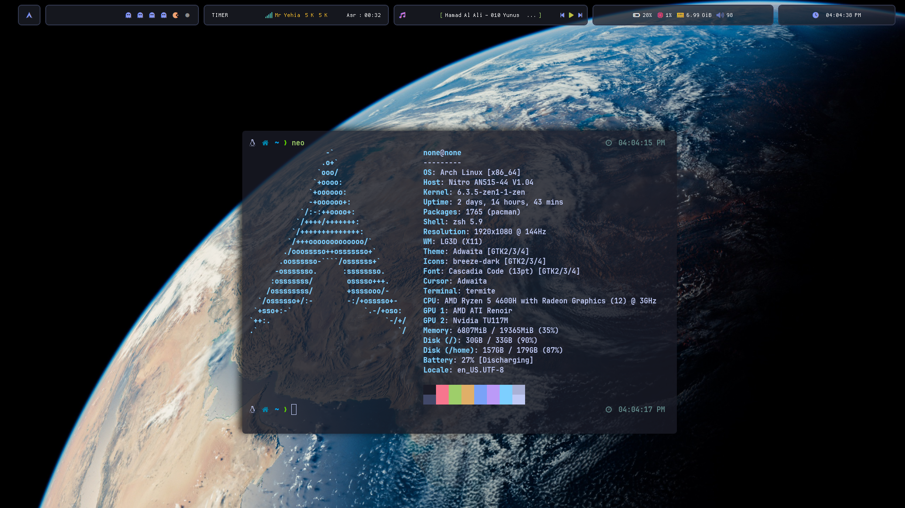

# Rice

This is my daily driver linux setup using ```bspwm```

| Program | usage |
| ------- | ----- | 
| `sxhkd`| for keybindings |
| `polybar`| the awesome bar |
| `picom`| lightweight compositor |
| `kitty` | my main terminal (doesn't support ar) |
| `neovim`| best of the cake |
| `tmux`| workflow management |
| `rofi`| dmenu replacement |
| `ranger`| nice file manager in python |
| `dunst`| notification daemon |
| `flameshot`| taking screenshots |

# Updates

- `kitty` : previewing images now work with the help of `ueberzug`
- `flameshot` : can't copy img after area selection is fixed now!
- System wide yanking works : `parcellite`
- Fully functional mpd
- Time for the Prayer in polybar : [Here](https://github.com/AYehia0/My-Personal-Tweaks/tree/master/_prayer)
- Theme switcher + some configs, thanks to @gh0stzk

# Screenshots

